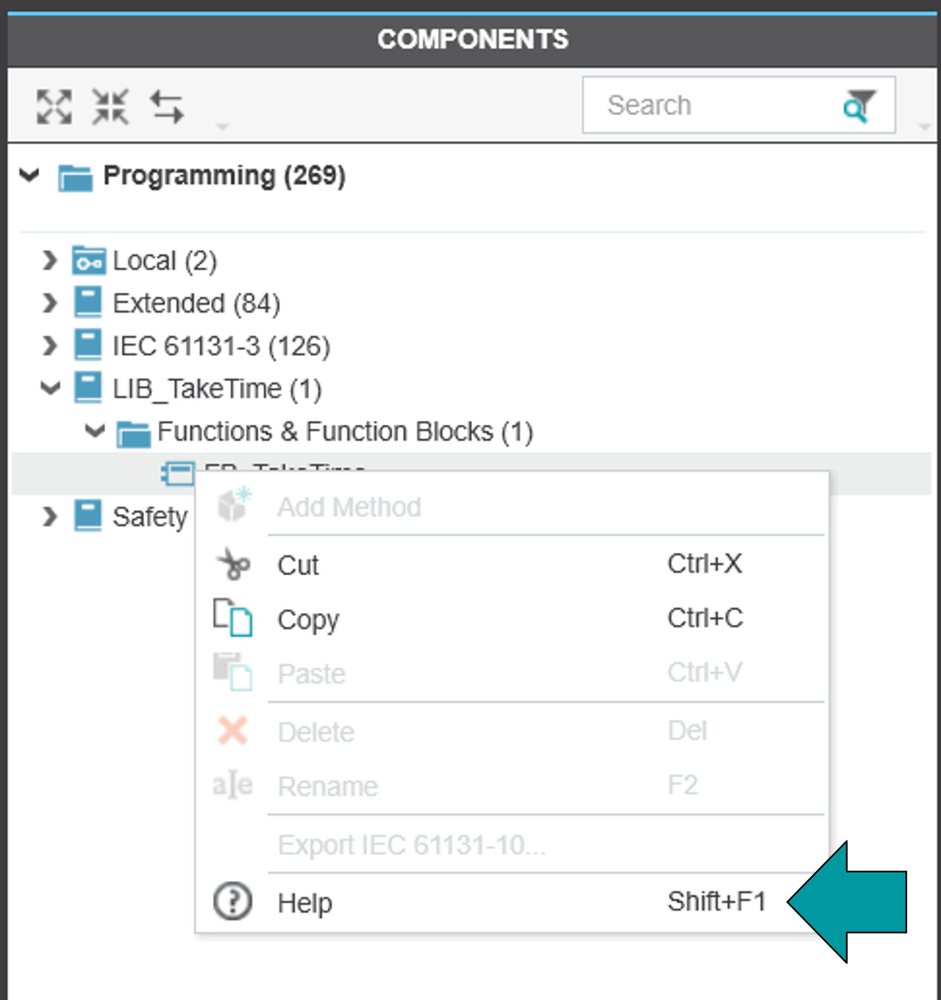

# Template_Library_Documentation
This template folder can be used to create a library documentation in Markdown.
The ouput formats are HTML and PDF.

--------------------------------

# Required software

To be able to generate the output files, the following software must be installed on your PC:

- Pandoc        --> https://pandoc.org/installing.html 	(free of charge)
- wkhtmltopdf   --> https://wkhtmltopdf.org/downloads.html 	(free of charge)

It may be nessecary to add both to your Windows system environment variables. This can be done within the system variables editor under "Path":

Select "Path" and click on "Edit". Then create two new entries here. The default paths are as shown in the screenshot below, but please compare them on your computer first:

In addition you will need a text editor for changing the Markdown files. In principle, you can use any
simple text editor. For Notepad++ there is an add-on, which offers additional comfort functions. You can  
also work with Visual Studio Code. It offers numerous convenience functions by default.

--------------------------------

# Known issues

The HTML5 help works for visible library content only. 
If you restrict a function block or function in order to protect it agains read-access, the HTML help cannot be opened via the PLCnext Engineer context menu.

--------------------------------

# Creation of the documentation

Follow these steps to build your documentation:

1. Copy the template folder to your PC and rename it to the name of your library.

2. Change to the subfolder "src/md". Here you can find the template files and a folder for images. The template files can be changed, duplicated or removed in case they are not needed. For changing, it may be useful to work in the order given by the file name prefix.
   In each file you will find comments that tell you what to do in the particular section. When you add a file, please also use a prefix for the file name. The prefix is important for the correct order of the chapters in the HTML/PDF to be created.

   To include images, place them in the "_images" directory.
        
   The documentation of functions and function blocks is in the subfolder "FBs_FUs". In this folder you can also create subfolders for groups. 
   A template folder for such a FB group is already prepared but can be deleted if it is not needed.
    
3. After all the Markdown files are created and customized, you can generate the HTML and PDF files.
   To do this, run the make.bat in the root directory of the documentation. 
   This can be done in the file explorer via double click on the batch file, or in the console window via: .\make.bat

   Here you will be prompted to enter the name of the library. Then press the Enter key.

4.  The output files can be found in the folders "html" and "pdf". In "html" you will find a general documentation file, which has the name of your library. In addition, you will find HTML files for each function or function block. They can be used to be included in PLCnext Engineer as FB/FU context help.

# Integration as HTML context help in PLCnext Engineer

Please note: The integration of a context help in HTML format requires PLCnext Engineer >= 2023.3.

1.  IMPORTANT! DO THIS BEFORE YOU CREATE THE PLCNEXT ENGINEER PROJECT:  
    In PLCnext Engineer go to "Extras" > "Options". In the section "Tool" > "Description" you can define the 
    location for the stylesheet file used for the FB/FU documentation. Set the path to the following folder: \<Path to your library documentation folder\>/html/styles

    In the case that your project was creates previously, set the stylesheet path, create a new project and use the function "File" > "Import from another Project" to add all FBs/FUs to the new project using the correct stylesheet.

2.  For functions and function blocks there is an editor "Description" (next to the code worksheets) in  PLCnext Engineer.
    Here a documentation can be integrated in the lower area. For this purpose there is the button "Import from HMTL file" above the field for the "Description". Select the HTML file from the
    documentation folder > "html" that is suitable for the respective FB/FU. Repeat this step for all FBs/FUs in your project.

4.  When you finished the programming of your FBs and FUs, you can create the library via "File" > "Release As Library".

For the library user the context help for the function blocks and functions is now available via SHIFT + F1.
The help will be displayed in the user's default browser and show the information of the respective FB/FU.
However, scrolling will allow you to see the full documentation.
