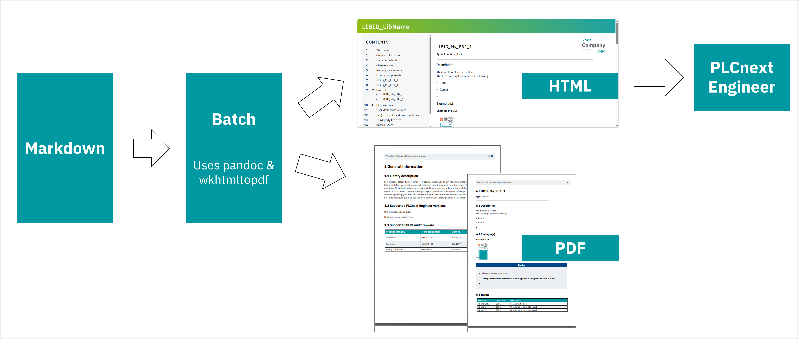
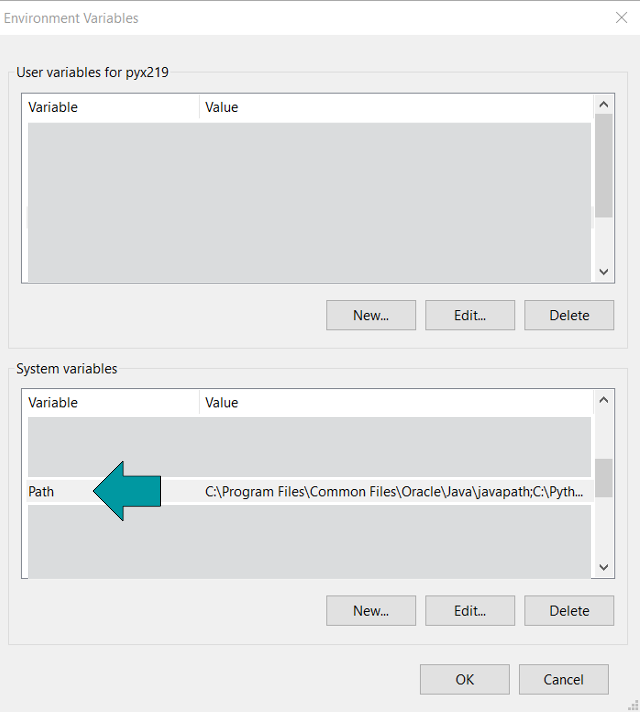
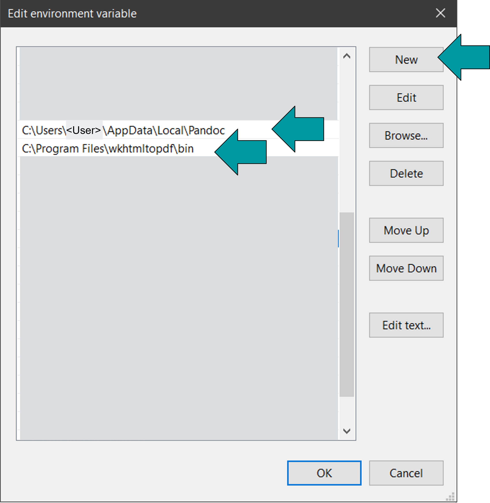
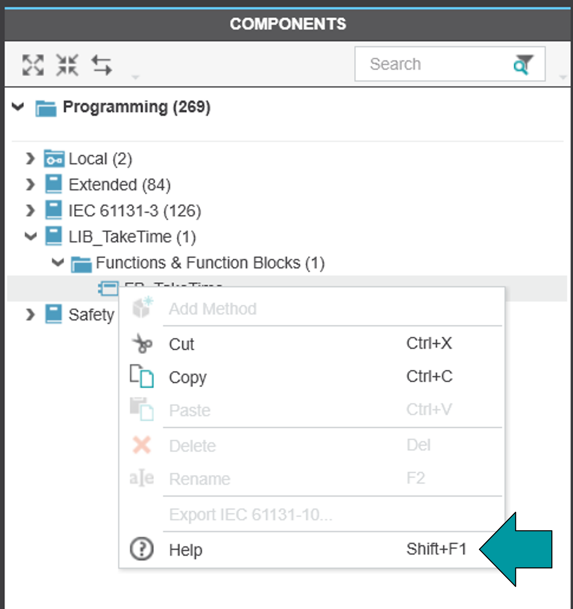
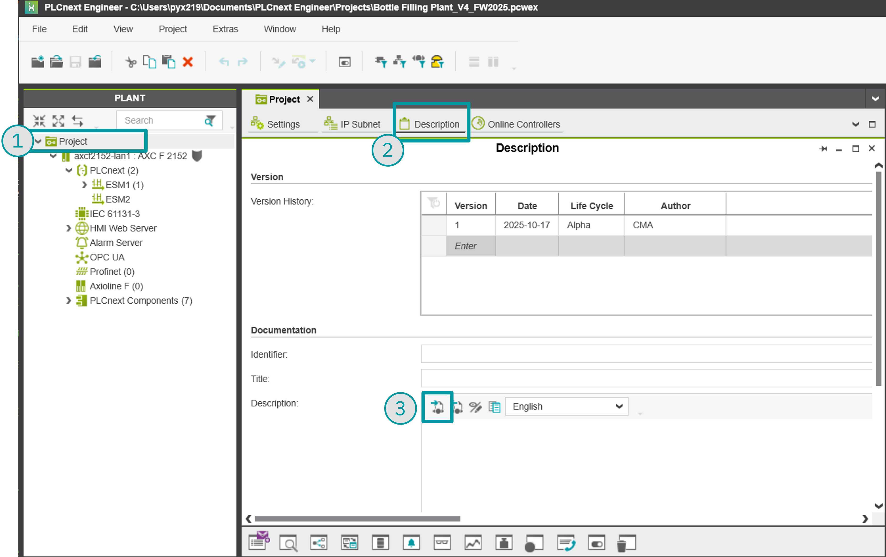
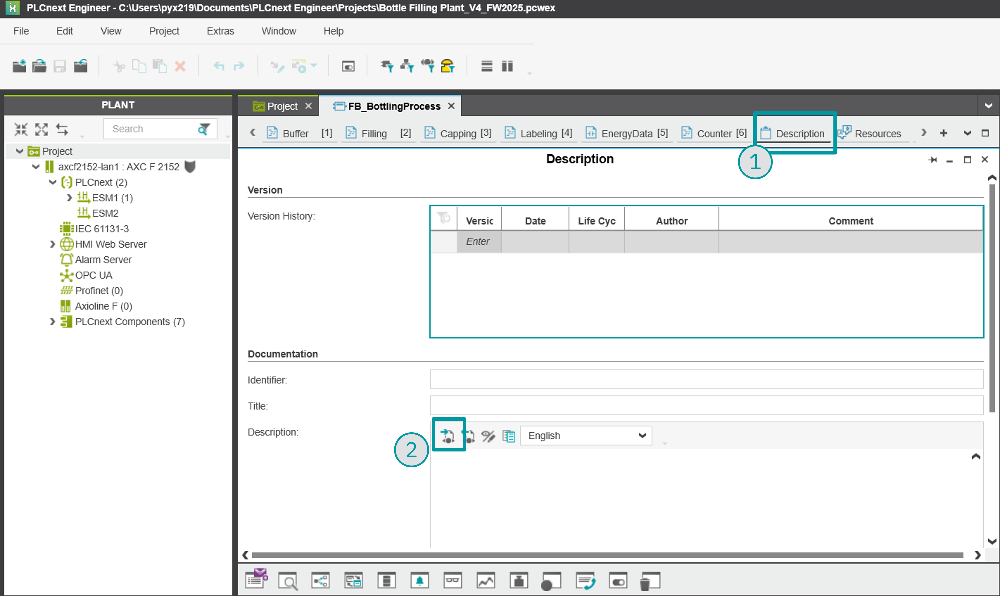
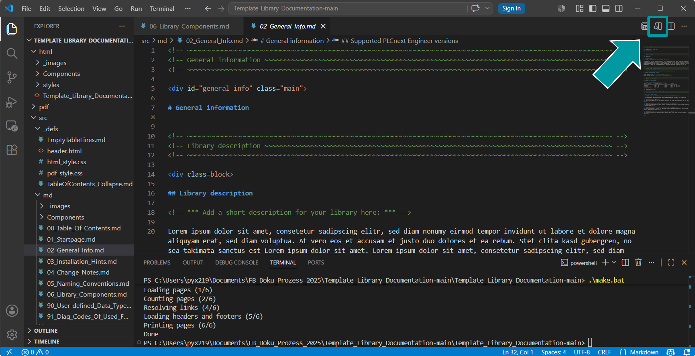

<!-- ~~~~~~~~~~~~~~~~~~~~~~~~~~~~~~~~~~~~~~~~~~~~~~~~~~~~~~~~~~~~~~~~~~~~~~~~~~~~~~~~~~~~~~ -->
<!-- Intro ~~~~~~~~~~~~~~~~~~~~~~~~~~~~~~~~~~~~~~~~~~~~~~~~~~~~~~~~~~~~~~~~~~~~~~~~~~~~~~~~ -->
<!-- ~~~~~~~~~~~~~~~~~~~~~~~~~~~~~~~~~~~~~~~~~~~~~~~~~~~~~~~~~~~~~~~~~~~~~~~~~~~~~~~~~~~~~~ -->

# Template_Library_Documentation

This template folder can be used to create library documentation in **Markdown**.

The output formats are: 
- **HTML**: can be imported into PLCnext Engineer to provide context-sensitive help for functions, function blocks and HMI symbols
- **PDF**: can be uploaded to the PLCnext Store to provide a printable documentation

 

 

The purpose of this documentation template is to:
- let you focus entirely on the content of your documentation,
- ensure that all information relevant to library users is included, 
- ensure that both **HTML** and **PDF** contain the same information and
- eliminate the need to worry about formatting.

 
To achieve this, the template provides Markdown template files, a ready-to-use batch script, and prepared stylesheets.

 

--------------------------------

<!-- ~~~~~~~~~~~~~~~~~~~~~~~~~~~~~~~~~~~~~~~~~~~~~~~~~~~~~~~~~~~~~~~~~~~~~~~~~~~~~~~~~~~~~~ -->
<!-- Table of contents ~~~~~~~~~~~~~~~~~~~~~~~~~~~~~~~~~~~~~~~~~~~~~~~~~~~~~~~~~~~~~~~~~~~~ -->
<!-- ~~~~~~~~~~~~~~~~~~~~~~~~~~~~~~~~~~~~~~~~~~~~~~~~~~~~~~~~~~~~~~~~~~~~~~~~~~~~~~~~~~~~~~ -->

# Table of contents

- [Template\_Library\_Documentation](#template_library_documentation)
- [Table of contents](#table-of-contents)
- [Required software](#required-software)
- [Known issues](#known-issues)
- [Creation of the documentation](#creation-of-the-documentation)
- [Integration as HTML context-sensitive help in PLCnext Engineer](#integration-as-html-context-sensitive-help-in-plcnext-engineer)
- [Additional Tips](#additional-tips)
  - [Template-related tips](#template-related-tips)
  - [Tips for Visual Studio Code](#tips-for-visual-studio-code)

--------------------------------

<!-- ~~~~~~~~~~~~~~~~~~~~~~~~~~~~~~~~~~~~~~~~~~~~~~~~~~~~~~~~~~~~~~~~~~~~~~~~~~~~~~~~~~~~~~ -->
<!-- Required software ~~~~~~~~~~~~~~~~~~~~~~~~~~~~~~~~~~~~~~~~~~~~~~~~~~~~~~~~~~~~~~~~~~~~ -->
<!-- ~~~~~~~~~~~~~~~~~~~~~~~~~~~~~~~~~~~~~~~~~~~~~~~~~~~~~~~~~~~~~~~~~~~~~~~~~~~~~~~~~~~~~~ -->

# Required software

To generate the output files, the following software must be installed on your PC:

| Required software | Download link                          | Costs          |
|-------------------|----------------------------------------|----------------|
|**Pandoc**         | https://pandoc.org/installing.html  	 | free of charge |
|**wkhtmltopdf**    | https://wkhtmltopdf.org/downloads.html | free of charge |

It may be necessary to add both tools to your Windows system environment variables. This can be done via the system variables editor under "**Path**":

Select "**Path**" and click on "**Edit**". Then create two new entries here. The default paths are shown below—please verify them on your system first:

Additionally, you will need a text editor to modify the Markdown files. Any basic editor will work.

- **Notepad++**: Add-ons provide additional convenience features
- **Recommendation:**  *Visual Studio Code*, which offers built-in features and a live preview of your documentation before generating it via the batch script.

--------------------------------

 

<!-- ~~~~~~~~~~~~~~~~~~~~~~~~~~~~~~~~~~~~~~~~~~~~~~~~~~~~~~~~~~~~~~~~~~~~~~~~~~~~~~~~~~~~~~ -->
<!-- Known issues ~~~~~~~~~~~~~~~~~~~~~~~~~~~~~~~~~~~~~~~~~~~~~~~~~~~~~~~~~~~~~~~~~~~~~~~~~ -->
<!-- ~~~~~~~~~~~~~~~~~~~~~~~~~~~~~~~~~~~~~~~~~~~~~~~~~~~~~~~~~~~~~~~~~~~~~~~~~~~~~~~~~~~~~~ -->

# Known issues

For **PLCnext Engineer versions < 2024.6** the HTML5 help works for visible library content only. 

If a function or function block is restricted to protect it from read access, the HTML help cannot be opened via the PLCnext Engineer context menu:

However, for **PLCnext Engineer ≥ 2024.6**, HTML help also works for restricted blocks.

--------------------------------

 

<!-- ~~~~~~~~~~~~~~~~~~~~~~~~~~~~~~~~~~~~~~~~~~~~~~~~~~~~~~~~~~~~~~~~~~~~~~~~~~~~~~~~~~~~~~ -->
<!-- Creation of the documentation ~~~~~~~~~~~~~~~~~~~~~~~~~~~~~~~~~~~~~~~~~~~~~~~~~~~~~~~~ -->
<!-- ~~~~~~~~~~~~~~~~~~~~~~~~~~~~~~~~~~~~~~~~~~~~~~~~~~~~~~~~~~~~~~~~~~~~~~~~~~~~~~~~~~~~~~ -->

# Creation of the documentation

Follow these steps to build your documentation:

1. **Prepare the template** : Copy the template folder to your PC and rename it to the name of your library.

2. **Edit the Markdown files**: 

    Navigate to "**src/md**"

    This folder contains template files and an image directory
    - Store images in the "**_images**" directory
    - The Markdown template files can be modified, duplicated, or removed as needed
    - Each file contains comments explaining what to do in each section.
    - It is recommended to follow the order defined by the filename prefixes

        
 <strong>! IMPORTANT !</strong> 
        The filename prefixes determine the chapter order in the PDF. When adding new files, always include a prefix. 
  
    
    - The function, function block and HMI symbol documentation is located in the "**Components**" subfolder
    - You can create additional subfolders for grouping (a sample group folder is already included and can be removed if not needed)

    
3. **Generate output files**: 

    Once all Markdown files are ready, run **make.bat** from the root directory:
    - Double-click in File Explorer, or
    - Run in the console: `.\make.bat`

4. **Check output**: 

    The output files are available in the folders "**html**" and "**pdf**". 
     - In "**html**" you will find a general documentation file, which has the name of your library. In addition, there are HTML files for each function, function block or HMI symbol in the "**Components**" folder. These HTML files can be used in PLCnext Engineer to provide component-related context help.
     
     
 <strong>Please note</strong>: These component-related HTML files cannot be displayed directly in a web browser. They serve as redirects to the corresponding sections within the full HTML documentation and function only after integration in PLCnext Engineer.
 

     - In "**pdf**" the complete documentation in PDF format can be found.

 

<!-- ~~~~~~~~~~~~~~~~~~~~~~~~~~~~~~~~~~~~~~~~~~~~~~~~~~~~~~~~~~~~~~~~~~~~~~~~~~~~~~~~~~~~~~ -->
<!-- Integration as HTML context-sensitive help in PLCnext Engineer ~~~~~~~~~~~~~~~~~~~~~~~~~~~~~~~~~ -->
<!-- ~~~~~~~~~~~~~~~~~~~~~~~~~~~~~~~~~~~~~~~~~~~~~~~~~~~~~~~~~~~~~~~~~~~~~~~~~~~~~~~~~~~~~~ -->

# Integration as HTML context-sensitive help in PLCnext Engineer

**Requirement**: PLCnext Engineer ≥ 2023.3

1.  
<strong>! IMPORTANT ! Perform this step before creating your PLCnext project:</strong>  
    In PLCnext Engineer, go to "<strong>Extras</strong>" > "<strong>Options</strong>". In the section "<strong>Tool</strong>" > "<strong>Description</strong>" you can define the location for the stylesheet file used for the documentation. Set the path to the following folder: &lt;Path to your library documentation folder&gt;/html/styles   

    If your project was created previously, set the stylesheet path, create a new project and use the option "**File**" > "**Import from another Project**" to add all FBs/FUs/symbols to the new project using the correct stylesheet.

2. Integration of the complete documentation:
    - Double-click on "**Project**"
    - Go to "**Description**"
    - Select the "**Import from HTML file**" button  
    

3.  Integration of the component-related help files: 
    - For functions, function blocks and HMI symbols there is an editor "**Description**" (next to the worksheets) in PLCnext Engineer. 
    - Here click the "**Import from HTML file**" button above the field for the "**Description**". 
    - Select the HTML file from the documentation folder > "**html/Components**" that is suitable for the respective FB/FU/symbol. Repeat this step for each component in your project.   
    

4.  After programming or symbol creation, create the library via "**File**" > "**Release As Library**".

For the library user, context-sensitive help for function blocks and functions is now available via SHIFT + F1.
The help will be displayed in the user's default browser and show the information of the respective component.

--------------------------------

 

<!-- ~~~~~~~~~~~~~~~~~~~~~~~~~~~~~~~~~~~~~~~~~~~~~~~~~~~~~~~~~~~~~~~~~~~~~~~~~~~~~~~~~~~~~~ -->
<!-- Additional Tips ~~~~~~~~~~~~~~~~~~~~~~~~~~~~~~~~~~~~~~~~~~~~~~~~~~~~~~~~~~~~~~~~~~~~~~ -->
<!-- ~~~~~~~~~~~~~~~~~~~~~~~~~~~~~~~~~~~~~~~~~~~~~~~~~~~~~~~~~~~~~~~~~~~~~~~~~~~~~~~~~~~~~~ -->

# Additional Tips

## Template-related tips

- Follow the file prefix order
- Read template comments carefully
- Organize large projects with many components into groups (see Group_1 example)
- Use internal links to improve navigation between sections
- Stylesheets can be customized in: "**/src/_defs**"
- To force a page break in the PDF, add the following to your Markdown file: `
 
`

## Tips for Visual Studio Code

- Open the entire documentation folder in Visual Studio Code: Go to "**File**" > "**Open Folder**".
- Theme settings: I recommend the use of the theme "**Dark Modern**" or "**Dark +**"- they are easy on the eyes and highlight the comments in green, so they become well-visible. To change the theme, go to "**File**" > "**Preferences**" > "**Theme**" > "**Color Theme**"
- Preview editor: In Visual Studio Code you can open a preview window, e.g. to check if the syntax is correct. Please note, that the stylesheet is not considered here.   

- Run the "**make.bat**" in Visual Studio Code directly: Via "**View**" > "**Terminal**" you can open the terminal in the currently opened folder. Here you can execute the batch script directly: `.\make.bat`

